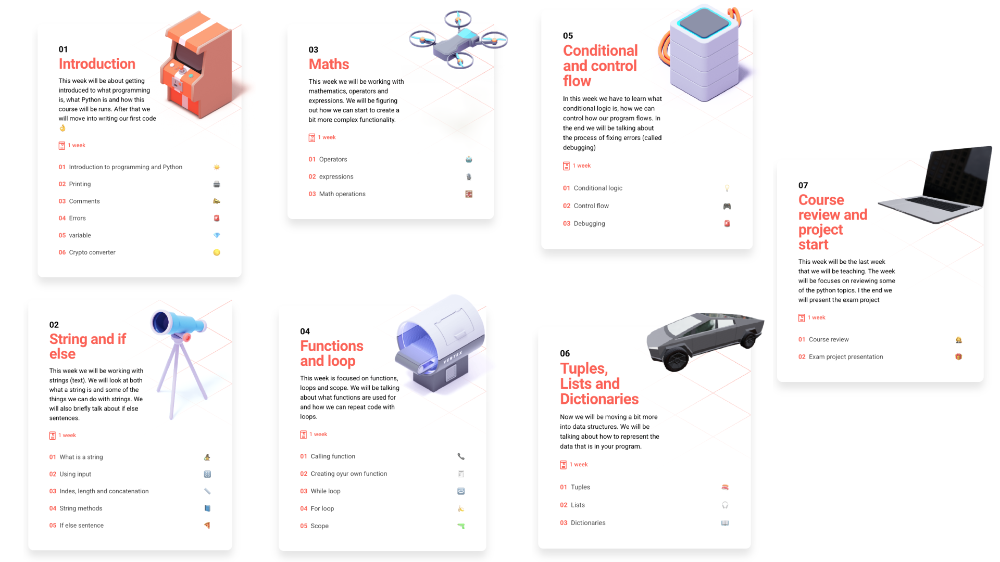

# Basic programming using Python

This course will be a basic programming course focused on learning the tool that is programming. We will be using python which right now is the more sought after programming language. It is versatile, beginner friendly but extremely powerful. 

## Course overview

## Semesterplan

| Class       | Date  | Subject                                                      | Preparation                                                 | Teacher             |
| ----------- | ----- | ------------------------------------------------------------ | ----------------------------------------------------------- | ------------------- |
| 1 - week 46 | 15/11 | Introduction to basic programming in Python                  | Chapter 1 og 3                                              | Benjamin og Nicklas |
| 2 - week 47 | 22/11 | Strings, string methods and if else                          | Chapter 4                                                   | Benjamin            |
| 3 - week 48 | 29/11 | Numbers and math                                             | Chapter 5                                                   | Nicklas             |
| 4 - week 49 | 6/12  | Functions and loops                                          | Chapter 6, [Videos](lectures/week-49.md#preparation-videos) | Benjamin            |
| 5 - week 50 | 13/12 | Debugging, conditional logic, control flow  + christmas exercise 🎅 | Chapter 7 + 8                                               | Benjamin            |
| 6 - week 1  | 3/1   | Tuples, Lists and Dictionaries                               | Chapter 9                                                   | Benjamin            |
| 7 - week 2  | 10/1  | Course review + exam project start                           |                                                             | Nicklas             |
| -           | 17/1  | Handin exam project 11                                       |                                                             |                     |
| -           | 24/1  | Exam                                                         |                                                             |                     |
| -           | 25/1  | Exam                                                         |                                                             |                     |

## Exam

You will be defending your handed in project over a 20 minute period

## Your teachers

### Benjamin Hughes

Digital Media Engineer from DTU. Has worked 8 years with software, primarely as a web developer. Has done interactive graphics at [ https://www.dr.dk/]( https://www.dr.dk/), been a co-funder at a company called Sunmapper and been an Educational Director for a web coding school called [https://www.hackyourfuture.dk/](https://www.hackyourfuture.dk/)

Follow him on twitter here: [https://twitter.com/DalsHughes](https://twitter.com/DalsHughes) or see his always slightly outdated portfolio here: [https://benna100.github.io/portfolio/](https://benna100.github.io/portfolio/)

Email: behu@kea.dk

### Nicklas Frederiksen

Software Developer / Cand.IT from ITU & BA. Informatics from RUC. Experience as a software developer and IT-analyst. Built data-analysis engines & SCRUM-mastered one of the Teams behind Nordea's trading platform Nordea Investor: [https://shorturl.at/iBUX9](https://shorturl.at/iBUX9.)

I don't have a twitter, so go follow: [https://twitter.com/DalsHughes](https://twitter.com/DalsHughes)

Email: nifr@kea.dk

