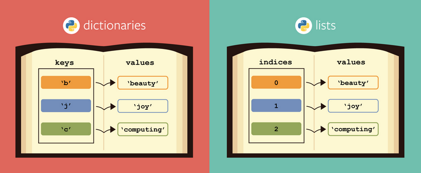

# Tuples, Lists and Dictionaries


## Feedback til Benjamin

https://forms.office.com/r/XEHzF19fkw


## Overview

- Feedback til min undervisning
- Feedback mht. Rock paper scissor
  - For det første, virkelig gode afleveringer! Ikke så mange, men de er virkeligt gode!
  - Only use global variables for truly global things. Define them in the top of the script. Avoid defining global inside a function
  - I er blevet skarpe på functioner, **men** i bruger parametre og argumenter for lidt.
  - Virkelig god brug af if, else, elif
  - `player1move` -> `player_1_move`
  - What method makes sense for this project? Pseudo code

```python
print("***************          Welcome to the Rock -> 🧠 Paper -> 🗒 Scissor -> ✂ Game  **********************")
print("*************** The game has 2 modes - play 2 people or you can play against the computer ***************")
print("The rules are\n rock wins over(smashes) scissor\n paper wins over(wraps) rock\n scissor wins over(cut) paper")

print("\nPlease enter S for Single Player Mode \n          or M for Multi Player Mode")
play_mode = input()

if play_mode == "M":
    print("You have selected Multipalyer Mode")
    multi_player_mode()
elif play_mode == "S":
    print("You have selected Single player Mode")
    single_player_mode()
else:
    print("You did not select a valid option -- The Program will end - Bye")
    exit()


```

- Quiz
- Undervisning
- Opgaver


## Quiz

```python
def is_logged_in(number):
    return number[-1] == "a"

if is_logged_in("hejsa"):
    print("logged in")
elif is_logged_in("hejsa"):
    print("not logged in")
else:
    print("in else")
```

Hvad bliver printet

- `logged in`
- `not logged in`
- `in else`
- `logged in`, `not logged in`
- `logged in`, `in else`
- Throws error


## Topics

- Datastructure
  - Models data
  - How would we model a student i a system?
  - How would we model a chess piece moving?

- List examples
- Tuple/list
  - Len, slicing, get value at index
  - Creating a tuple
  - Contain any datatype
  - Immutable


- List
  - square brackets
  - Len, slicing, get value at index
  - Change item, mutable
  - Pop, append, extend
  - Loop list
  - List comprehension
  - Sort
    - `key`
    - `Reverse = True`


Shared list/tuple

- Len, slicing, get value at index
- Iterable
- In


- Dictionaries
  - Key, value
  - Creating
  - Acccessing
  - Adding and removing values


- How to pick
  - give some examples
    - Student name and their grade
    - Shopping list
    - list of all danish cpr numbers
    - A municipality and the number of people living there





## Exercises


### Exercise 1

In groups of two find a partner group. Then with the partner group decide what group takes what topic. Now investigate what the methods below does? Create some code showing how to use the method in a program

- List: `max`, `min`, `sum`, `insert`
- Dict `in` and how a dictionary is `iterable`. How can we loop through a dictionary?


1. Spend 10 minutes investigating in your group
2. Spend 10 minutes presenting. Make it easy to understand


### Level 1

Tuple

- 9.1.1
- 9.1.2
- 9.1.4
- 9.1.5


List

- 9.2.1
- 9.2.2
- 9.2.5
- 9.2.7
- 9.2.8


Dict

- 9.6.1
- 9.6.2
- 9.6.3
- 9.6.5


### Level 2

- 9.4
- 9.5
- 9.9


## Project for next class

[Data structures 💽](../projects/data-structures.md)


## Before next class

Check if you are ready with this quiz: https://realpython.com/quizzes/pybasics-tuples-lists-dicts/