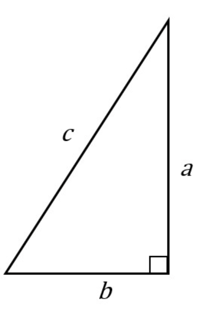

# Week 48 - Maths

**Teams møde: **https://teams.microsoft.com/l/meetup-join/19:w330wMm3u592zdz4EbpSEHRvRVjDfRFH_6TWUiY9m-A1@thread.tacv2/1638200557695?context=%7B%22Tid%22:%22d10c3c6e-c228-4944-8b6a-6067c6afe3c9%22,%22Oid%22:%2203a0eca4-8da8-409e-a1aa-94505c23075f%22%7D

#### Before <u>next</u> class (w. 49) 

Check if you are ready with this quiz: https://realpython.com/quizzes/pybasics-numbers/

- [https://youtu.be/8fN8h7REnyo](https://youtu.be/8fN8h7REnyo)
- [https://youtu.be/YZ11aS9QV6c](https://youtu.be/YZ11aS9QV6c)
- [https://youtu.be/J8hP1MTbBeg](https://youtu.be/J8hP1MTbBeg)
- [https://youtu.be/GDEaklG5Gbw](https://youtu.be/GDEaklG5Gbw)

## Todays program

- Numerical operators / operands
- Numerical types
- Math functions 
- Boolean operators / operands

## Math methods

**Square root**

```python
sqrt(4)
```

**Exponent**

```python
pow(2, 4) #Returns 2 to the power of 4

#OR

result = 2**4 #Returns 2 to the power of 4
```

**Rounding**

```python
#Rounding upwards 
result = ceil(4.3)

#Rounding down
another_result = floor(4.5)

print(result) #Will print 5
print(another_result) #Will print 4
```


## Exercises 1

##### How many miles? 

- Write a program that prompts the user for a number of miles
- The program prints how many kilometers that equates to
  - One mile is 1.609344 km

##### How many hours? 

- Write a program that prompts the user for a number of days
- The program prints how many seconds the amount of days equates to

##### Package

- Write a program that prompts the user for a package's weight in kg and price in dkk
- The program prints out what the package's price pr. kg

###### Advanced:

- The program asks for two packages' weight in kg and price in dkk
- The program prints out what package has the best price pr. kg


## Exercises 2

##### Pythagoran calculator

- Write a program that prompts the user for two sides *a* and *b* of a right triangle

  

- The program prints the length of the last side

Hint & Verification: https://www.calculatorsoup.com/calculators/geometry-plane/pythagorean-theorem.php

## Pair programming

#### Exercise 1

- Write a program that asks the user for two input numbers and prints the maximum number

- Expand the program such that is asks the user for three input numbers and prints the maximum number
- Write a program  that asks for the user's name. If the name is "Bond" make it print "Welcome on board 007." Otherwise make it print "Good morning *NAME*". (Replace Name with user's name)

#### Exercise 2

- Write a program that prompts the user for a number
- If the number is even, the program prints "Even"
- If the number is odd, the program prints "Odd"
- If the number is 0, the program prints "Most would say it's even"
