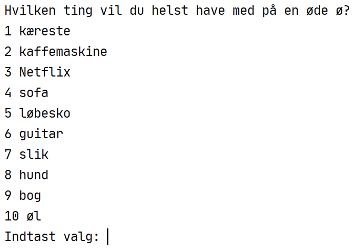
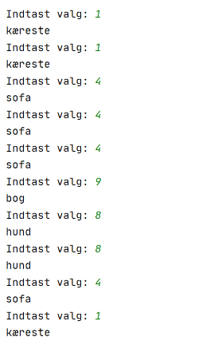

# Data structures


## Desert island

Lav et "Desert island" program, der spørger folk, hvad de helst vil have med, hvis de lander på en øde ø. Før statistik over hvad folk svarer og udskriv det mest print svar.


Lav en list of 10 ting man kan have med på en øde ø. Spørg brugeren hvilke 10 ting de helst vil have med på en øde ø.

Her er et eksempel på hvordan programmet kunne se ud:





Her er et eksempel på en bruger der vælger nogle forskellige ting



I det her tilfælde er det sofaen der er mest populær. Derfor skriver man `Mest populære valg er sofa`


### *Valgfri*

- Spørg brugeren om hvor mange ting de vil have med
- Bliv ved med at spørge brugeren indtil brugeren trykker på `q`. Derefter viser man det mest populære valg


## The Wire - enkoder

In an episode of the television show *The Wire*, drug dealers assume the police are intercepting their text messages. Whenever a phone number needs to be texted in the course of a criminal conspiracy, the dealers will obfuscate the number. They use an algorithm we’ll call  “Jump the Five” because each number is changed to its mate on the opposite of a US telephone pad if you jump over the 5. 


Write a function called `get_jump_encoder` that takes a phonenumber and encodes it using "Jump the five" method


```python
phone_encoded = get_jump_encoder("23638561")
print(phone_encoded) # 87472549
```


### Jumpe the five dekoder - *Valgfri*

Lav dekoderen (den modsatte)

```python
phone_decoded = get_jump_decoder("87472549")
print(phone_decoded) # 23638561
```


## Handin

Handin your project here: [https://kea-fronter.itslearning.com/LearningToolElement/ViewLearningToolElement.aspx?LearningToolElementId=958642](https://kea-fronter.itslearning.com/LearningToolElement/ViewLearningToolElement.aspx?LearningToolElementId=958642)

**Deadline: Sunday 09/01 23:59**


### How to handin

- Navigate to the link above
- Click `Besvar opgave`
- Leave `Dit svar` blank
- Add your `.py` file where it says `Tilføj filer`
  - You can do that by dragging and dropping 
  - Or click the area and select the `.py` file 
- Click `Send`