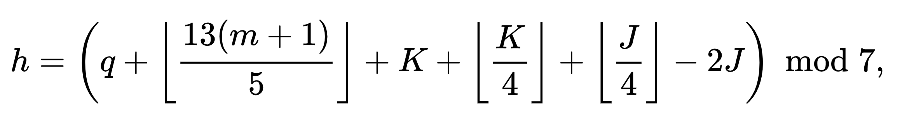
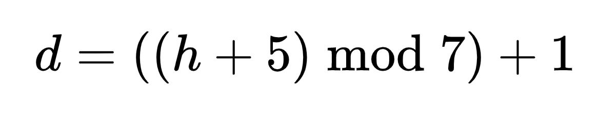

# US population forecasting

**Hand-in: ** https://kea-fronter.itslearning.com/LearningToolElement/ViewLearningToolElement.aspx?LearningToolElementId=949611

The US Census Bureau projects population based on the following assumptions: 

- One birth every 7 seconds 
- One death every 13 seconds
- One new immigrant every 45 seconds 

Write a program to display the population for each of the next five years. 

Assume the current population is 312,032,486 and one year has 365 days.

##### Advanced (Optional)

Expand the program such that:

- A user can input how many years in the future they would like forecasted - meaning that the program is not limited to 5 years.

### (Optional challenge) Zellers Congruence

Zellers Congruence is an algorithm developed by Christian Zeller to calculate the day of the week. 

Write a program that will calculate the result of Zellers Congruence

- *d* is the **result** - the day of the week (Monday: 1, Tuesday: 2 ... Sunday: 7)
- *q* is the day of the month
- *m* is the month (3 = March, 4 = April, 5 = May, ..., 14 = February)

- *K* the year of the century *year modulus 100*
- *J* is the [zero-based](https://en.wikipedia.org/wiki/Zero-based_numbering) century For example, the zero-based centuries for 1995 and 2000 are 19 and 20 respectively
-  is the **floor** function
- mod is the [modulo operation](https://en.wikipedia.org/wiki/Modulo_operation) or remainder after division (%)

**note** in this algorithm January and February are counted as months 13 and 14 of the previous year. E.g. if it is 2 February 2010, the algorithm counts the date as the second day of the fourteenth month of 2009 (02/14/2009 in DD/MM/YYYY format)

**The user inputs day, month and year - and the algorithm will calculate day of the week.**