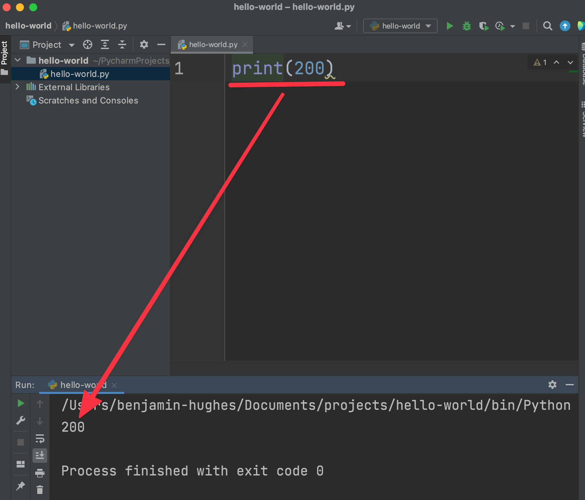
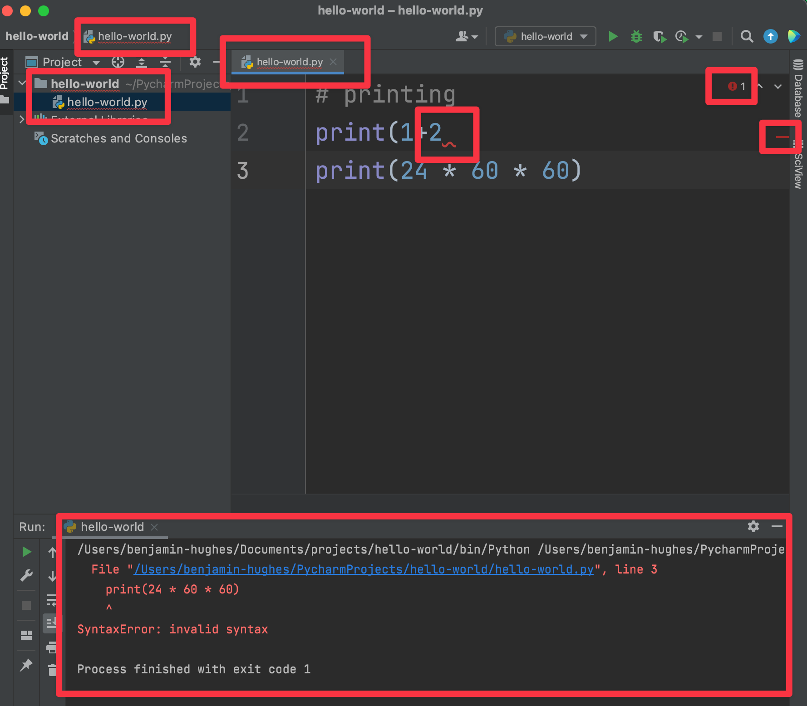
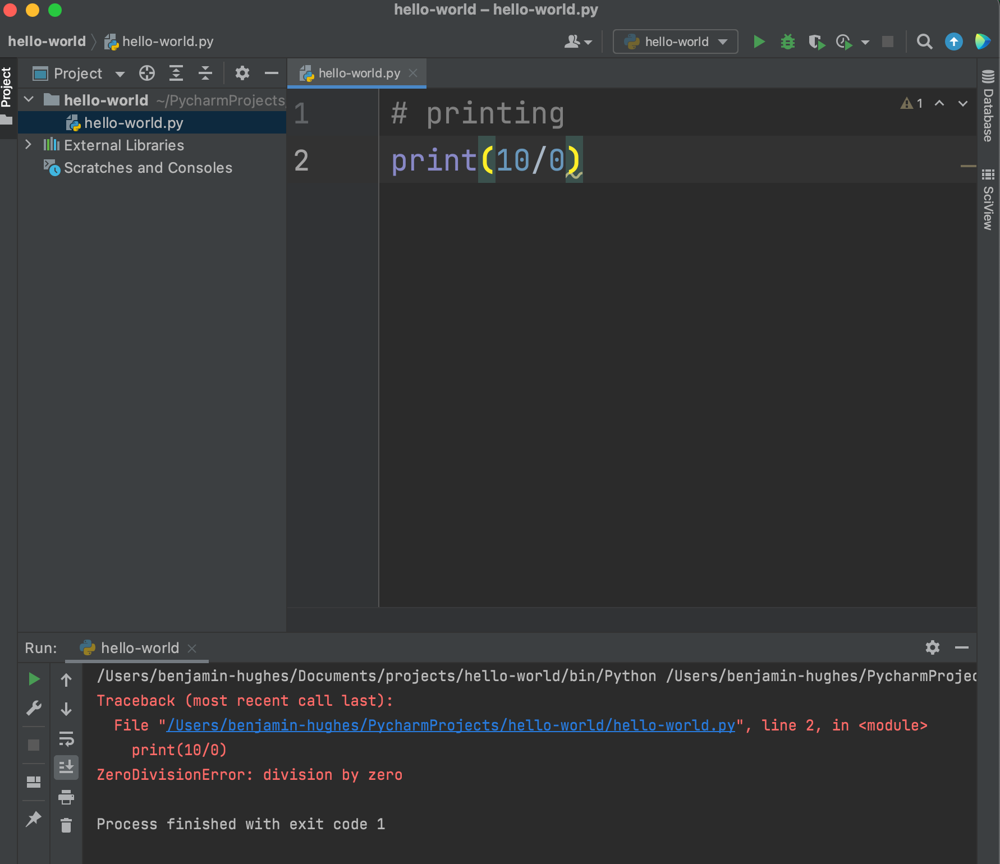
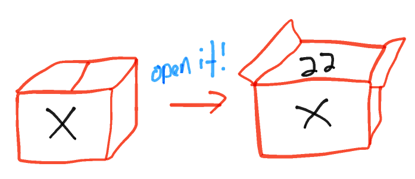

# Print, comments, error and variables


## Print

Printing means printing some text or fx a number to the console!

Printing is typically used for us developers to see the data in our program or to check that the program is running as we expect

Let's try it out 👇

```python
print(200)
```

This should print the number `200` to the console. The console can be found in the bottom of PyCharm





Let's try and log some text. In programming terms we call text for a string. For Python to know that we are printing a string we surround the string with quotes

```python
print("Hello world")
```

So now we are printing the string `Hello world` to the console


We also print things on the same line

```python
print("I am", 23, "years old") # I am 23 years old
```


We can even print math operations!

```python
print(1+2)
```


## Comments

When programming it can be a big help to document the code you are writing. That can be done through comments in the code. You write a comment using number sign (`#`)

Only comment where you think it makes sense to comment your code. That is typically when you do something a bit difficult. **Comments will not be run by python**

```python
# printing number of seconds in a day
print(24 * 60 * 60)

# printing number of minutes in a day
print(24 * 60)
```


## Errors

Reading and understanding errors is an enevitable part of writing software. In the beginning it can be uncomfortable seeing an error, you might even be a bit afraid of one. But don't worry we will help translating the errors

There are two types of errors

#### Syntax errors 

Syntax errors happen when you write code that is not allowed in the python language. The program wont run if you have a syntax error and PyCharm will warn you!

Try and insert this into your IDE

```python
print(1+2
print(24 * 60 * 60)
```




You can see that there are **a lot** of red arrows. Especially the one right next to `2` is interesting. This is PyCharms way of saying that we have a syntax error here. If we try to run it anyway we get the error we can see in the console

```
File "/Users/benjamin-hughes/PycharmProjects/hello-world/hello-world.py", line 3
    print(24 * 60 * 60)
    ^
SyntaxError: invalid syntax
```

It's saying that there is a `SyntaxError` at line 3 in the `hello-world.py` file. But the syntax mistake is at line 2! That because of the code that is running our code (interpreter). It first sees the error when it tries (and fails) to run line 3. 

So how do we fix this error?


#### Runtime errors

Runtime errors happens when the program is running. So fx in mathematics and programming we cannot divide with 0. It's simply not allowed. So let's try and see what happens if we do that:

```python
print(10/0)
```



Here we see that there are no errors in the IDE. **But** in the console we see that the interpreter has thrown an error

We first see where the error occurred line 2 in the `hello-world.py` file. Then we see the error message `ZeroDivisionError: division by zero`. It means that we cannot divide by 0

How do we fix this error?


## Variables

Variable are used to hold values. It's a way to save a values inside a small box you could say

```python
x = 22
```





### Variable with string

Let's create our first variable 👇

```python
name = "benjamin"
```

In this code we first create a new variable called `name`, then we set this variable to the string `benjamin`. So now the variable `name` holds the string `benjamin`. We can check that by printing the variable out!

```python
name = "benjamin"
print(name)
```

Now in the console we see that it has printed out `benjamin`


### Variable with number

Let's create a variable that contains a number

```python
denmark_population = 5830000
print(denmark_population) # logs 5830000
```

 We can maybe make the print a bit more user friendly 👇

```
denmark_population = 5830000
print('The population of Denmark is:')
print(denmark_population)
```


#### Operators

In python we can add, subtract, multiply and divide as follows

```python
addition = 2 + 1
subtraction = 2 - 1
multiplication = 2 * 1
division = 2 / 1

a = 10
b = 20
print(a + b) # 30
```


## Exercises


### Exercise 1

Write some code that throws a syntax error


### Exercise 2

Write some code that throws a runtime error


### Exercise 3

Fix this code one line at a time!

```python
print('Welcome to my python program)
fourDoubled  4 * 2
name = benjamin
print name
```


### Exercise 4

Create a variable that will contain your favourite color. Print out the color


### Exercise 5

Print the following lines 👇

```
Get up, Stand up 
Stand up for your right 
Get up, Stand up 
Don´t give up the fight!
				Bob Marley
```


### Exercise 6

A client has asked us if we can write a program for his webshop! His webshop has different products they sometimes reduce in price. What our program need to do is figure out the decrease in price a product has been reduced

The first product we receive is a Samsung television that is on sale. Before it was 3000 kr. now it is 2000 kr. We need to figure out the decrease in price. 

Create variable for the Samsung television, the before price and the after price. Now create a new variable that will hold the decrease in price

Now using those variables print out the following 👇

```
Save 1000 kr on a Samsung television. Reduced from 3000 kr to 2000 kr
```

*Hint: To print without the new line, check the print section!*

Now do the same for another a PlayStation 5 that is reduced from 5000 to 4500


#### Percentage savings - advanced

Do the same as above but also add the percentage savings

```
Save 33% (1000 kr) on a Samsung television. Reduced from 3000 kr to 2000 kr
```

*Hint: figure out how to calculate the percentage decrease using Google. You also need to figure out precedence of operators to solve this exercise: https://www.programiz.com/python-programming/precedence-associativity*

