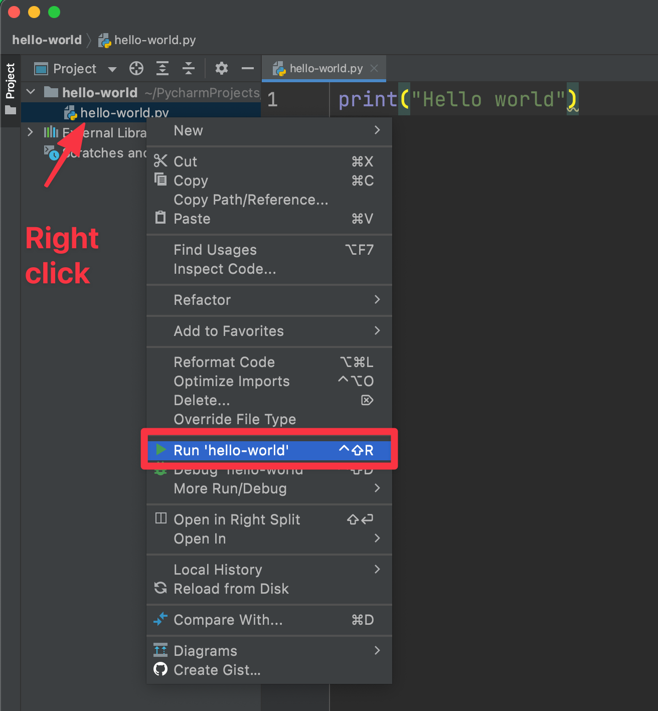

# Programming in PyCharm

PyCharm is an IDE which means integrated development environment. An IDE is where we will be writing our code. It's an advanced texteditor.


## Developing our first program


### Creating a new project

Open up PyCharm and click on New Project. 


Then we get a screen like this 👇

First select a location on your computer where you want to save the project. Now select `Previously configured interpreter`. Untick `create a main.py welcome script`. Now click on `Create`


We have now created a new but empty project 🎉


### Creating a python file

New **right-click** the project folder (in my case it is the folder called `hello-world`). To even see this view, you might have to click the `Project` tab in the left side that is written horizontally.


Give the file a name and press enter. I will call my python file `hello-world`


Yeah we are a small step closer 🎉


### Writing some code and run it

Inside the editor write this code:

```python
print("Hello world")
```


Now to run the python file the first time, right-click the file and choose `Run 'NAME_OF_YOUR_FILE'` (in my case ) `Run 'hello-world'`



After you have chosen `Run 'hello-world'` you can click on the green play icon in the top right corner to run your code


Now you can see the output in the output window in the bottom


- This line `/Users/benjamin-hughes/Documents/projects/hello-world/bin/Python /Users/benjamin-hughes/PycharmProjects/hello-world/hello-world.py` is the code that actually runs your code. 
- `Process finished with exit code 0` means that the code has stopped


Congratulations you have now created your first python program 👌💪