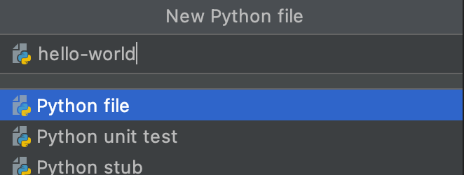

# Programming in PyCharm

PyCharm is an IDE which means integrated development environment. An IDE is where we will be writing our code. It's an advanced texteditor.

## Installing PyCharm

- Go to: https://www.jetbrains.com/estore/students/ 
- Create a new user with your KEA e-mail address
- Download and install PyCharm
- Start PyCharm and select JetBrains Account
- Type your email, password and select Activate

## Developing our first program

### Creating a new project

Open up PyCharm and click on New Project.

Then we get a screen like this 👇

We have now created a new but empty project 🎉

### Creating a python file

New **right-click** the project folder (in my case it is the folder called `hello-world`). To even see this view, you might have to click the `Project` tab in the left side that is written horizontally.

Give the file a name and press enter. I will call my python file `hello-world`

Yeah we are a small step closer 🎉

### Writing some code and run it

